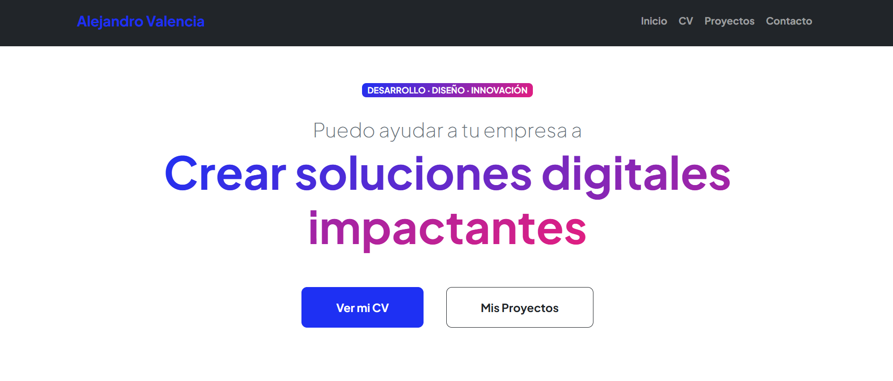
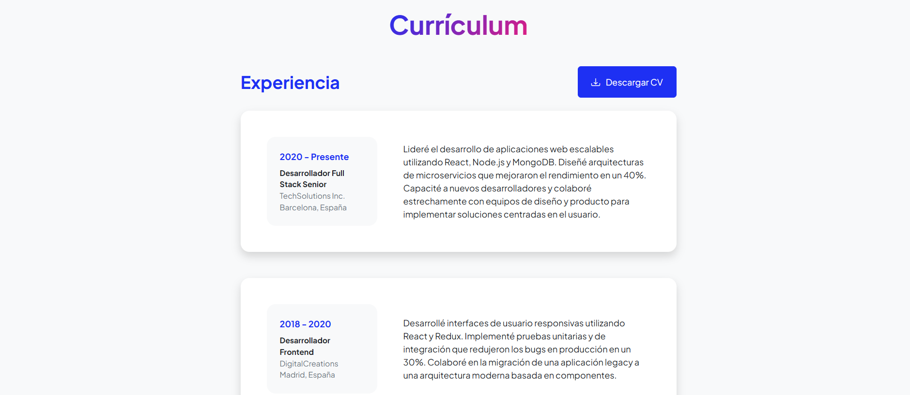
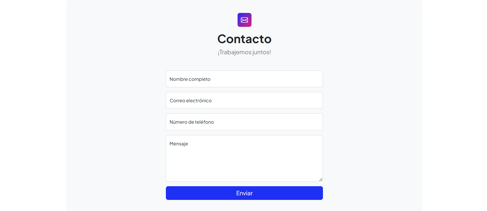

# 📁 Portafolio de Práctica – Alejandro Valencia Tenorio

Este proyecto consiste en un **portafolio ficticio** creado con fines **exclusivamente prácticos y educativos**, utilizando una **plantilla de Bootstrap gratuita descargada de Internet**.  
El único dato real es el nombre del desarrollador: **Alejandro Valencia Tenorio**.  
Todo el contenido, como experiencia, educación y habilidades, ha sido inventado para simular un currículum profesional.

---

## 📝 Descripción del sitio

El sitio simula un portafolio profesional con estructura de una página web moderna. Está dividido en las siguientes secciones principales:

### 🔹 Menú de navegación

- **Inicio** – Presentación ficticia y bienvenida.
- **CV** – Currículum simulado con experiencia laboral, formación académica y habilidades.
- **Proyectos** – Lista ficticia de proyectos personales o profesionales.
- **Contacto** – Formulario visual de contacto (no funcional).

---

## 💻 Tecnologías utilizadas

- **Bootstrap 5**
- **HTML5 + CSS3 personalizados**
- **Bootstrap Icons**
- **JavaScript**
- **Google Fonts**

---

## 📄 Contenido de la sección “CV”

### 🧑‍💼 Experiencia Profesional (ficticia)

- **2020–Presente** – *Desarrollador Full Stack Senior* en **TechSolutions Inc.** (Barcelona, España)  
  Desarrollo de aplicaciones web con React, Node.js y MongoDB.

- **2018–2020** – *Desarrollador Frontend* en **DigitalCreations** (Madrid, España)  
  Interfaces responsivas con React y migración de aplicaciones legacy.

---

### 🎓 Formación Académica (ficticia)

- **Máster en Ingeniería de Software**  
  *Universidad Politécnica de Madrid* (2016–2018)  
  Enfoque en arquitecturas escalables y desarrollo ágil.

- **Grado en Ingeniería Informática**  
  *Universidad de Barcelona* (2012–2016)  
  Proyecto final: plataforma de e-commerce con Node.js.

---

## 🛠️ Habilidades y tecnologías (simuladas)

### Habilidades técnicas

- Desarrollo Full Stack  
- Arquitectura de Software  
- Optimización de Rendimiento  
- Testing Automatizado  
- DevOps Básico  
- Diseño UX/UI

### Tecnologías

- JavaScript / TypeScript  
- React / Redux  
- Node.js / Express  
- MongoDB  
- Docker / Kubernetes  
- AWS / GCP

---
## 📸 Capturas de pantalla

### 🖥️ Vista principal  

### 🗂️ Sección Proyectos  

### 📬 Formulario de Contacto  

---

## 🌐 GitHub Pages

El portafolio está publicado en *GitHub Pages* como práctica:  
👉 [Ver portafolio en línea](https://pupuendo.github.io/Portafolio/)

---

## ❗ Notas importantes

- Proyecto **100% ficticio** para uso académico o personal.
- No se recomienda reutilizar la información tal cual.
- Código abierto y editable para aprendizaje.
- Puedes personalizar imágenes, enlaces y datos con tu propio perfil real.
- Para dudas o sugerencias, puedes abrir un issue en el repositorio.

---

**¡Gracias por visitar este portafolio de práctica!**  
Desarrollado por **Alejandro Valencia Tenorio**.
